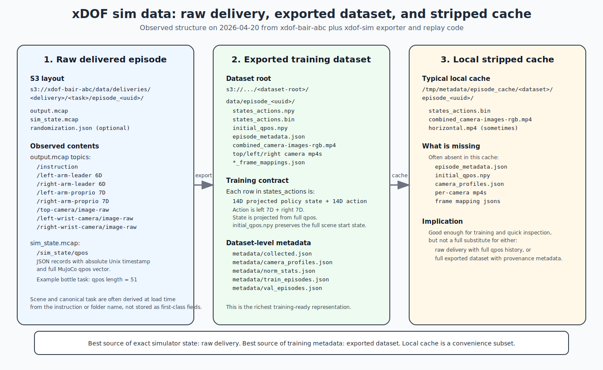

# xDOF Sim Data Layout And Metadata

Date: 2026-04-20

This document breaks down the xDOF sim data that is currently stored in the BAIR xDOF bucket, how that raw delivery format differs from the exported trainable dataset format, and what metadata is actually available at each stage.

The short version is:

- raw delivered sim episodes are the source of truth for full simulator state
- exported datasets are the source of truth for training-ready metadata
- local cached episodes are often a stripped subset and should not be treated as the full dataset contract

## Quick Breakdown

If you only need the high-level picture, use this section.

### Raw delivered sim episode

Path shape:

```text
s3://xdof-bair-abc/data/deliveries/<delivery>/<task>/episode_<uuid>/
  output.mcap
  sim_state.mcap
  randomization.json   # optional
```

What it contains:

- prompt text in `/instruction`
- leader-arm action streams
- proprio streams
- recorded camera packets
- full simulator qpos trajectory in `sim_state.mcap`
- optional randomization state

Best used for:

- exact replay
- debugging scene setup
- recovering full simulator state

### Exported training dataset

Path shape:

```text
s3://<output-bucket>/<dataset-root>/
  data/episode_<uuid>/
  metadata/
```

What it contains:

- `states_actions.npy` and `states_actions.bin`
- videos and frame mapping JSONs
- `episode_metadata.json`
- `initial_qpos.npy`
- dataset-level metadata such as `collected.json`, `camera_profiles.json`, `norm_stats.json`, `train_episodes.json`, and `val_episodes.json`

Best used for:

- policy training
- registry integration
- training-ready replay and metadata lookup

### Stripped local cache

Typical path shape:

```text
/tmp/metadata/episode_cache/<dataset>/episode_<uuid>/
```

What it usually contains:

- `states_actions.bin`
- `combined_camera-images-rgb.mp4`
- sometimes `horizontal.mp4`

What it often does not contain:

- `episode_metadata.json`
- `initial_qpos.npy`
- per-camera videos
- dataset-level metadata

Best used for:

- quick local inspection
- lightweight visualization
- cached training inputs

### One-line distinction

- raw delivery is the full simulator recording
- exported dataset is the full training artifact
- local cache is a convenience subset

## Figure



## Scope

This note is based on:

- observed bucket structure under `s3://xdof-bair-abc/`
- a concrete delivered sim episode:
  - `s3://xdof-bair-abc/data/deliveries/sim_tasks_20260409/sim_throw_plastic_bottles_in_bin/episode_019d7218-eb54-7943-b495-311de98a872d`
- the exporter and replay code in this repo

Related code and docs:

- [dataset_export_workflow.md](./dataset_export_workflow.md)
- [xdof_sim/dataset_export/writer.py](/home/sky/src/sim/xdof-sim/xdof_sim/dataset_export/writer.py:1)
- [xdof_sim/dataset_export/metadata.py](/home/sky/src/sim/xdof-sim/xdof_sim/dataset_export/metadata.py:1)
- [xdof_sim/dataset_export/trajectory.py](/home/sky/src/sim/xdof-sim/xdof_sim/dataset_export/trajectory.py:1)
- [xdof_sim/rendering/replay/episode.py](/home/sky/src/sim/xdof-sim/xdof_sim/rendering/replay/episode.py:1)
- [xdof_sim/randomization.py](/home/sky/src/sim/xdof-sim/xdof_sim/randomization.py:1)

## Top-Level Bucket Structure

At the top level, the xDOF bucket currently contains:

```text
s3://xdof-bair-abc/
  checkpoints/
  data/
  eval-logs/
```

Under `data/`, there are multiple categories:

```text
s3://xdof-bair-abc/data/
  dagger_test_data/
  deliveries/
  sim_test_data/
  tmp/
```

The sim data relevant to this repo is under `data/deliveries/`, for example:

```text
s3://xdof-bair-abc/data/deliveries/
  sim_tasks_20260409/
  sim_tasks_20260414/
  pretraining_tasks_20260407/
  pretraining_tasks_20260409/
  pretraining_tasks_20260410/
  performance_tasks_realsense_20260407/
  performance_tasks_realsense_20260409/
  performance_tasks_realsense_20260414/
  performance_tasks_dexcin_20260407/
  performance_tasks_dexcin_20260409/
  ...
```

For sim deliveries, the expected raw episode layout is:

```text
s3://xdof-bair-abc/data/deliveries/<delivery>/<task>/episode_<uuid>/
  output.mcap
  sim_state.mcap
  randomization.json   # optional
```

That matches the assumptions in [dataset_export_workflow.md](./dataset_export_workflow.md).

## Format 1: Raw Delivered Sim Episode

Raw delivered episodes are the closest thing to source-of-truth sim recordings. They are small in file count, but dense in content.

### File Layout

For a concrete example:

```text
s3://xdof-bair-abc/data/deliveries/sim_tasks_20260409/
  sim_throw_plastic_bottles_in_bin/
    episode_019d7218-eb54-7943-b495-311de98a872d/
      output.mcap
      sim_state.mcap
```

In the example episode above, the raw file sizes were roughly:

- `output.mcap`: 8.0 MB
- `sim_state.mcap`: 3.6 MB

### `output.mcap`

`output.mcap` is the policy-facing recording. In the inspected bottle example, it contained these topics:

- `/instruction`
- `/left-arm-leader`
- `/right-arm-leader`
- `/left-arm-proprio`
- `/right-arm-proprio`
- `/top-camera/image-raw`
- `/left-wrist-camera/image-raw`
- `/right-wrist-camera/image-raw`

Observed message counts for that example:

- `/left-arm-leader`: `3276`
- `/right-arm-leader`: `4106`
- `/left-arm-proprio`: `10496`
- `/right-arm-proprio`: `10496`
- `/top-camera/image-raw`: `300`
- `/left-wrist-camera/image-raw`: `300`
- `/right-wrist-camera/image-raw`: `300`
- `/instruction`: `1`

Observed per-message dimensions:

- leader streams: `6D`
- proprio streams: `7D`

The replay/export path uses those as follows:

- each arm's leader stream gives the arm joint action target
- the gripper channel is taken from aligned proprio
- each arm becomes a `7D` action
- left and right are concatenated into the `14D` action used by training

This behavior is implemented in [episode.py](/home/sky/src/sim/xdof-sim/xdof_sim/rendering/replay/episode.py:284).

### `sim_state.mcap`

`sim_state.mcap` stores the simulator state history. In the current loader, it is read as a JSON MCAP stream on:

- `/sim_state/qpos`

Each record looks like:

```json
{
  "timestamp": 1775735627.0962133,
  "qpos": [...]
}
```

Important details:

- timestamps are absolute Unix epoch seconds
- `qpos` is the full MuJoCo simulator state, not the compressed policy state
- the dimensionality depends on the scene/model

In the inspected bottle example:

- `/sim_state/qpos` had `10496` messages
- each `qpos` vector had length `51`

The loader for this is [load_sim_states()](/home/sky/src/sim/xdof-sim/xdof_sim/rendering/replay/episode.py:643).

### `randomization.json`

`randomization.json` is optional. I did not see it in the sim delivery prefixes I spot-checked, but the code supports it when present.

Its serialized content comes from [RandomizationState](/home/sky/src/sim/xdof-sim/xdof_sim/randomization.py:55) and includes:

- `seed`
- `object_states`

Each `object_states` entry stores absolute object placement:

- `pos`
- `quat`

This is useful because it is self-contained scene setup metadata, independent of re-running the sampler.

### What Metadata Is Actually Serialized In Raw Delivery

Raw delivery definitely stores:

- prompt text via `/instruction`
- arm action streams
- arm proprio streams
- recorded camera packets
- full qpos trajectory in `sim_state.mcap`
- optional randomization state

What it does not cleanly store as first-class metadata in the delivered sim layout:

- canonical normalized `task_name`
- finalized dataset split membership
- normalization statistics
- camera profile id
- exported video provenance

Also, for delivered episodes the loader usually derives `scene` and canonical `task` from the instruction text or the task folder name, rather than reading them as authoritative serialized fields. See [resolve_delivered_task()](/home/sky/src/sim/xdof-sim/xdof_sim/rendering/replay/episode.py:679).

## Format 2: Exported Trainable Dataset

The exporter converts raw deliveries into the trainable xDOF dataset format used by the BC pipeline.

The destination layout is:

```text
s3://<output-bucket>/<dataset-root>/
  data/
    episode_<uuid>/
      combined_camera-images-rgb.mp4
      combined_camera-images-rgb_frame_mappings.json
      top_camera-images-rgb.mp4
      top_camera-images-rgb_frame_mappings.json
      left_camera-images-rgb.mp4
      left_camera-images-rgb_frame_mappings.json
      right_camera-images-rgb.mp4
      right_camera-images-rgb_frame_mappings.json
      states_actions.npy
      states_actions.bin
      initial_qpos.npy
      episode_metadata.json
  metadata/
    collected.json
    camera_profiles.json
    norm_stats.json
    train_episodes.json
    val_episodes.json
```

This layout is described in [dataset_export_workflow.md](./dataset_export_workflow.md) and written by [writer.py](/home/sky/src/sim/xdof-sim/xdof_sim/dataset_export/writer.py:1).

### Per-Episode Data Files

Each exported episode contains:

- `states_actions.npy`
- `states_actions.bin`
- `initial_qpos.npy`
- `episode_metadata.json`
- one combined RGB video
- one per-camera RGB video for each camera
- one frame mapping JSON beside each video

### `states_actions.npy` and `states_actions.bin`

These are the training arrays. Each row is:

```text
14D state + 14D action
```

More specifically:

- the `14D state` is the policy-space projection of full MuJoCo qpos
- the `14D action` is left `7D` plus right `7D`

For export, the writer stores these arrays as `float64` on disk. The replay loader can read either `float64` or `float32` binaries by inferring dtype from file size.

Relevant code:

- [write_states_actions()](/home/sky/src/sim/xdof-sim/xdof_sim/dataset_export/writer.py:26)
- [_load_dataset_states_actions()](/home/sky/src/sim/xdof-sim/xdof_sim/rendering/replay/episode.py:35)

### `initial_qpos.npy`

This stores the full initial MuJoCo qpos for the exported episode.

This matters because:

- `states_actions` only preserves the projected 14D policy state
- the full scene setup is needed for faithful action replay later
- `initial_qpos.npy` is the bridge from the exported training dataset back to simulator initialization

The current exporter writes:

- `initial_qpos.npy`
- `initial_qpos_file`
- `initial_qpos_dim`

Relevant code:

- [write_initial_qpos()](/home/sky/src/sim/xdof-sim/xdof_sim/dataset_export/writer.py:44)
- [write_episode_metadata()](/home/sky/src/sim/xdof-sim/xdof_sim/dataset_export/writer.py:60)

### `episode_metadata.json`

Per-episode exported metadata currently includes:

- `episode_id`
- `task_name`
- `instruction`
- `scene`
- `task`
- `source_delivery`
- `source_episode_dir`
- `num_steps`
- `fps`
- `image_width`
- `image_height`
- `render_backend`
- `cameras`
- `videos`
- `initial_qpos_file`
- `initial_qpos_dim`

Important distinctions:

- `instruction` is the free-form prompt text
- `task_name` is the normalized snake_case registry key
- `task` is the simulator task identifier
- `scene` is the simulator scene name

### Video Files And Frame Metadata

Each exported RGB video gets a sidecar mapping JSON:

- `combined_camera-images-rgb_frame_mappings.json`
- `top_camera-images-rgb_frame_mappings.json`
- `left_camera-images-rgb_frame_mappings.json`
- `right_camera-images-rgb_frame_mappings.json`

Those mapping files contain:

- `frames`
  - `pts`
  - `duration`
  - `key_frame`
- `stream`
  - `time_base`
  - `avg_frame_rate`

This metadata is written by [write_frame_mappings()](/home/sky/src/sim/xdof-sim/xdof_sim/dataset_export/video_io.py:154).

## Dataset-Level Metadata

Under `metadata/`, the exported dataset contains the higher-level training metadata.

### `collected.json`

Each episode entry in `collected.json` contains:

- `batch_name`
- `source_delivery`
- `task_name`
- `episode_id`
- `index_name`
- `data_date`
- `size`
- `operator_id`
- `cameras`
- `camera_profile_id`

Notes:

- `size` is the number of exported trajectory steps
- `data_date` is derived from timestamps
- `operator_id` exists in the schema but may be empty for sim export

The internal `_camera_profile` payload is used during export and then split out into `camera_profiles.json`; it is not retained inside final `collected.json`.

Relevant code:

- [build_collected_entry()](/home/sky/src/sim/xdof-sim/xdof_sim/dataset_export/metadata.py:72)
- [export_dataset()](/home/sky/src/sim/xdof-sim/xdof_sim/dataset_export/pipeline.py:141)

### `camera_profiles.json`

This file is keyed by `camera_profile_id`. Each value contains:

- `backend`
- `fps`
- `resolution`
  - `width`
  - `height`
- `cameras`

This is the stable rendering-profile metadata for a dataset.

### `norm_stats.json`

This contains normalization statistics for:

- `state`
- `actions`

For each of those, the exporter writes:

- `mean`
- `std`
- `q01`
- `q99`

These arrays are padded or truncated to the trainer's expected size, usually `32`.

Relevant code:

- [compute_norm_stats()](/home/sky/src/sim/xdof-sim/xdof_sim/dataset_export/metadata.py:218)

### `train_episodes.json` and `val_episodes.json`

These are stable lists of episode ids produced from a seeded random split.

They store:

- training episode ids
- validation episode ids

They do not add per-episode metadata beyond membership in the split.

## Format 3: Local Cached Episode Directories

There is a third format that is easy to confuse with the real dataset: the stripped local episode cache, for example under:

```text
/tmp/metadata/episode_cache/sim_tasks_20260414_madrona_224/
  episode_<uuid>/
```

In the cached episodes I inspected, the files were typically just:

- `states_actions.bin`
- `combined_camera-images-rgb.mp4`
- sometimes `horizontal.mp4`

This cache often does not contain:

- `episode_metadata.json`
- `initial_qpos.npy`
- per-camera RGB videos
- frame mapping JSONs
- full dataset-level metadata such as `camera_profiles.json`

That means the cache is useful for:

- training input inspection
- quick offline reconstructions
- lightweight visualization

But it is not enough to fully replace:

- raw delivery, if you need the full qpos trajectory
- full exported dataset, if you need provenance or full metadata

## What Exists At Each Layer

### Raw delivered sim episode

Best for:

- exact simulator state
- prompt recovery
- raw action and proprio streams
- debugging scene initialization

Available metadata:

- prompt text
- full qpos trajectory
- optional randomization state
- recorded cameras
- implicit task identity via path or instruction

### Exported trainable dataset

Best for:

- model training
- registry integration
- split metadata
- normalization stats
- replay from training-ready assets

Available metadata:

- normalized task name
- prompt text
- scene and task
- source delivery provenance
- export resolution, fps, backend
- camera profile metadata
- train/val split metadata
- norm stats
- initial full qpos

### Stripped local cache

Best for:

- quick local iteration
- lightweight video inspection
- loading `states_actions.bin`

Available metadata:

- only whatever survives caching, usually training arrays and one or two videos

## Key Distinctions To Keep Straight

1. The raw delivery contains the full simulator qpos trajectory.
2. The exported dataset compresses state to the 14D policy state for training, but now also stores `initial_qpos.npy` so action replay can still start from the correct full scene state.
3. The stripped local cache is not the same thing as the exported dataset contract.
4. `instruction`, `task`, and `task_name` are different layers:
   - `instruction` is free-form text
   - `task` is the simulator task id
   - `task_name` is the normalized training/registry key

## Practical Guidance

If the question is "where is the full simulator state?", use:

- raw delivered episodes
- especially `sim_state.mcap`

If the question is "what does training consume?", use:

- exported dataset episodes
- especially `states_actions.npy` or `states_actions.bin`
- plus `metadata/collected.json`, `norm_stats.json`, `train_episodes.json`, and `val_episodes.json`

If the question is "why is this local cached episode missing metadata?", the answer is usually:

- it is a stripped cache, not the canonical exported dataset

## Recommended Mental Model

Treat the three layers as separate products:

- raw delivery: simulator recording
- exported dataset: training artifact
- local cache: convenience subset

Confusion tends to happen when the cache is mistaken for the exported dataset, or when the exported dataset is expected to contain the full replayable qpos history instead of a training projection plus initial scene state.
